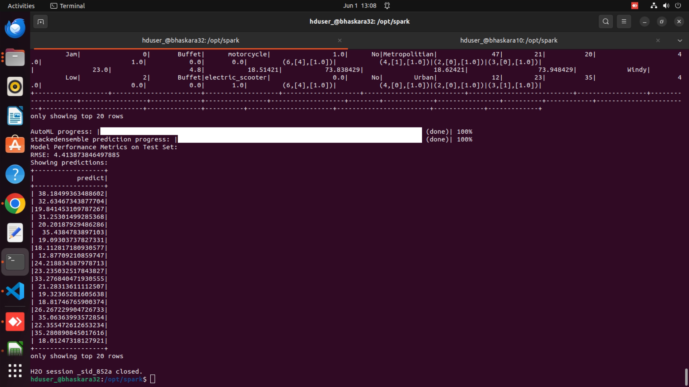

# Zomato Delivery Time Prediction using Sparkling Water(Pyspark+H2O) Multinode Distributed Computing.
# Zomato Delivery Time Prediction using Sparkling H2O Multinode

## Overview

This project aims to predict delivery time on Zomato using a distributed computing approach with Sparkling Water, a framework by H2O.ai that integrates H2O’s machine learning capabilities with Apache Spark. By leveraging the power of a multinode Spark cluster, we can efficiently handle large datasets and complex computations, ensuring faster processing and model training.

The project involves the following steps:
1. Setting up a multinode Spark cluster.
2. Initiating a Spark session and creating an H2O context across the cluster.
3. Loading and preprocessing the data to handle missing values and prepare it for model training.
4. Training the machine learning model using H2O’s algorithms.
5. Evaluating the model’s performance and making predictions.

## Repository Structure

- `data/`: Directory containing the dataset files used for training and testing the model.
- `sparkling_water_running_images/`: Directory containing images of various stages of the project.
- `spark3.py`: The main Python script to run the project.
- `requirements.txt`: Lists the dependencies required for the project.
- `Project Work Outline.txt`: Provides a detailed outline of the project work.
- `pyspark_multinode_instructions.txt`: Contains instructions for setting up the multinode cluster in ubuntu environment and running the project.

### Data Folder

The \`data\` folder contains the dataset files used for training and testing the model.

### Images Folder

The \`sparkling_water_running_images\` folder contains images of various stages of the project, including the setup and prediction outputs.

### Scripts

- \`spark3.py\`: The main Python script to run the project.
- \`requirements.txt\`: Lists the dependencies required for the project.
- \`Project Work Outline.txt\`: Provides a detailed outline of the project work.
- \`instructions.txt\`: Contains instructions for setting up and running the project.

## Instructions

Detailed instructions for setting up and running the project are available in the \`instructions.txt\` file.

## Requirements

The project requirements are listed in the \`requirements.txt\` file. 

## Running the Project

Please follow \`instructions.txt\` file

## Output

### Prediction Performance

- The Root Mean Square Error (RMSE) of our prediction model is **4.41**.

### Screenshots

- A screenshot of the prediction output is available below and in the \`sparkling_water_running_images\` folder with the filename \`model_training_prediction.png\`.

- A screenshot of the actual and predicted delivery time is available below and in the \`sparkling_water_running_images\` folder with the filename \`prediction_plot.png\`.

## Contributing

Contributions are welcome! Please open an issue or submit a pull request for any changes.
